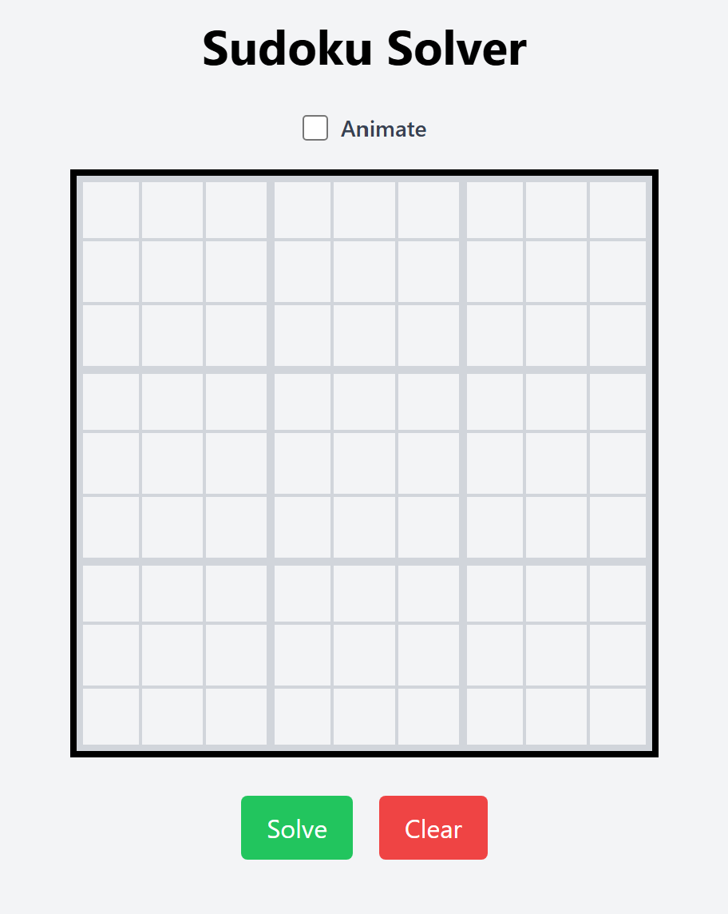

# Sudoku Solver

An interactive Sudoku solving application built with **Next.js**, **React**, and **TypeScript**. Enter any puzzle and the app will solve it instantly or play each solving step with smooth animations.



## Features

- Responsive 9x9 grid 
- Optional step-by-step animation showing the backtracking algorithm
- Written in TypeScript and styled with Tailwind CSS

## Getting Started

```bash
npm ci

npm run dev
```

Open `http://localhost:3000` in your browser and begin entering Sudoku puzzles. Toggle the **Animate** checkbox to watch the algorithm in action.

### Production Build

```bash
npm run build
npm start
```

A network connection is required during the build to download fonts from Google Fonts.

## How it works

The solver uses a classic backtracking algorithm implemented in [`lib/sudokuSolver.ts`](lib/sudokuSolver.ts). See [docs/ALGORITHM.md](docs/ALGORITHM.md) for a walkthrough of the algorithm.

## Project Structure

- `app/` - Next.js pages and components
- `lib/` - Sudoku solving logic
- `public/` - Static assets
- `docs/` - Additional documentation

## License

This project is released under the MIT License.